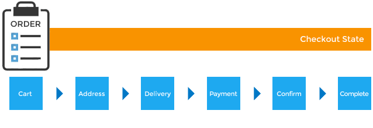

# Order & Checkout Guide

## Components
### Order (Model)
See [here](../models/Order.md)

### Line Item (Model)
See [here](../models/LineItem.md)

### Adjustment (Model)
See [here](../models/Adjustment.md)

## Order Manual Entry
* Can be done through the Admin Interface (Orders -> New Order)
* Visually detailed in [Spree User Guide](https://guides.spreecommerce.com/user/entering_orders.html)

## Returns
Detailed under [Inventory Guide](../controllers/Inventory.md#Returns)

## `Order` Model & State Machine
* `Spree::Order` state machine is the foundation of the checkout process and it utilizes
[state_machine](https://github.com/pluginaweek/state_machine) gem (used in `Spree::Shipment` and `Spree::InventoryUnit` too)
* Checkout flow is defined in `app/models/spree/order/checkout.rb`
* A `Spree::Order` object has an initial state of 'cart'
* Various events transition `Spree::Order` to different order states
* There's no separate model or DB table for a 'cart' so the "shopping cart" is
  actually a `Spree::Order`
* An order cannot continue to the next state until the previous state has been satisfied
* you can transition an order by calling `next` on it. If `false` returns, then it doesn't meet
the next state's criteria. Check the `errors` message
* An order is considered in-progress or incomplete when its `completed_at` attribute is `nil`
* Incomplete/abandoned orders can be filtered during reporting and it's possible to write a quick script to periodically purge them


### Order States


| State      | Description                                                                    |
|------------|--------------------------------------------------------------------------------|
| `cart`     | One or more products were added to the shopping cart                           |
| `address`  | Awaiting billing and shipping address data                                     |
| `delivery` | Awaiting shipping method selection                                             |
| `payment`  | Awaiting payment data. Triggered if `payment_required?` returns `true`         |
| `confirm`  | Awaiting confirmation. Triggered if `confirmation_required?` returns `true`    |
| `complete` | No payment required on the order or at least its total was received as payment |

### Order Statuses
Include order states in addition to:

| Status            | Description                                                             |
|-------------------|-------------------------------------------------------------------------|
| `canceled`        | Either customer or store admin has chosen to cancel the order           |
| `awaiting return` | Customer elected to return products, but they haven't yet been received |
| `return`          | Return has been processed                                               |
| `resumed`         | Formerly canceled order has been reactivated                            |


## Checkout Steps
With the exception of Registration, each step corresponds to an `Order` state:
1. Registration (only if using `spree_auth_devise` gem)
2. Address Information
3. Delivery Options (Shipping Method)
4. Payment
5. Confirmation


#### Step 1: Registration
`spree_auth_devise` gem adds a `check_registration` before filter to all `CheckoutController`
actions (except `registration` and `update_registration` actions)
```
def check_registration
  return unless Spree::Auth::Config[:registration_step]
  return if spree_current_user or current_order.email
  store_location
  redirect_to spree.checkout_registration_path
end
```
This redirects to a registration page unless one of the following is true:
* `Spree::Auth::Config[:registration_step]` preference is not `true`
* user is already logged in
* current order has an email address associated with it (use [Spree configurations](preferences_guide.md#Spree_Configuration_Options) to control guest checkout)

#### Step 2: Address Information
* Allows user to add both their:
    1. **Shipping Address** where the order's product(s) should be shipped (determines
shipping methods available)
    2. **Billing Address** where the user paying for the order is (alters the tax
rate which can change the final order total)
* Users can use the same address for both
* Use [Spree configurations](preferences_guide.md#Spree_Configuration_Options) to control some address fields characteristics

#### Step 3: Delivery Options
Shipping methods available will depended on the shipping address

#### Step 4: Payment
> See [Payments Guide](payments_guide.md)

#### Step 5: Confirmation
* Step where user reviews their order before submitting and can return to any step in the process using the back button or clicking on a step in the *progress breadcrumb*
* Disabled by default (except for payment methods that support
payment profiles), but can be enabled by overriding `confirmation_required?`
method in `Spree::Order`

## Checkout Controller
Drives the state of an order during checkout
> Documented [here](../controllers/frontend/checkout_controller.md)

## *Customization Tips*
> Intermediary order states can be configured using the [Checkout Flow API](#Checkout_Flow_DSL)

### Updating an Order
If you change an `Order` object in code in anyway and you want to update totals and associated
adjustments and shipments, call `update!` method on the object (this will call `OrderUpdater`)

For example, if you create or modify an existing payment for the order which would change the order's
`payment_state` to a different value, calling `update!` will cause the `payment_state` to be
recalculated for that order.

Another example is if a `LineItem` within the order had its price changed. Calling `update!` will
cause the totals for the order to be updated, the adjustments for the order to be recalculated, and
then a final total to be established.


### Adding Logic Before or After a Step
* `state_machine` gem allows implementing callbacks before or after transitioning to a particular
step
* The callbacks work similarly to [Active Record Callbacks]
(http://guides.rubyonrails.org/active_record_callbacks.html) so you can specify a method or block
of code to be executed prior to or after a transition
* If the method executed in a `before_transition` returns false the transition will not execute

##### *Example*
If you wanted to verify that users provide valid zip codes before transitioning to delivery step:

1. Implement a `valid_zip_code?` method
2. Tell the state machine to run this method before that transition by placing this in
`app/models/spree/order_decorator.rb`:
```
Spree::Order.state_machine.before_transition :to => :delivery,
                                             :do => :valid_zip_code?
```
This callback now prevents transitioning to `delivery` step if `valid_zip_code?` returned false

### Customizing the View for a Step
* Each default checkout steps has a partial under `app/views/spree/checkout`
* Changing the view for a step is as simple as overriding its relevant partial
* Alternatively, if the relevant partial has a usable theme hook, you can add your
functionality using [Deface](https://github.com/spree/deface)

### Checkout Flow DSL
* Allows defining different checkout steps and customizing checkout flow without touching
unrelated admin states (such as `canceled` and `resumed` which an order can transition to)
* Provides shorter syntax compared with overriding the entire `Spree::Order` state machine
* default checkout flow is defined like this:
```
checkout_flow do
  go_to_state :address
  go_to_state :delivery
  go_to_state :payment, if: ->(order) {
    order.update_totals
    order.payment_required?
  }
  go_to_state :confirm, if: ->(order) { order.confirmation_required? }
  go_to_state :complete
  remove_transition :from => :delivery, :to => :confirm
```
* You can pass a block on each checkout step definition and add logic to see if it's required
dynamically (e.g. confirmation might only be necessary when using Payment Profiles)
* These conditional states present a situation where an order could transition
from delivery to payment, confirm or complete step. We prevented delivery to confirm transition
using `remove_transition` method of the Checkout DSL
* Resulting transitions between states look like the image below:
* Two helper methods are provided on `Spree::Order` instances for convenience:
  * `checkout_steps`: Returns array list of all currently possible states of the checkout
  * `has_step?`: Used to check if the current order fulfills the requirements for a specific state

#### Adding Steps with `insert_checkout_step` Helper
Takes a `before` or `after` option to determine where to insert the step:
```
insert_checkout_step :new_step, :before => :address
# or
insert_checkout_step :new_step, :after => :address
```
##### Step View
A view partial is needed for the checkout controller to load the new step. In our example we'll create a `spree/checkout/_new_step.html.erb` partial.

##### Step "Breadcrumb"
Spree automatically creates a progress "breadcrumb" based on available checkout states from
`Spree::Order#checkout_steps` method. If you add a new state you'll want to add its translations
in the relevant translation in `config/locales` directory of your extension or application:
```
en:
  order_state:
    new_step: New Step
```
> Use of the breadcrumb is entirely optional and doesn't need to correspond to checkout states
nor does every state need to be represented. Feel free to customize this behavior as well.


#### Removing Steps with `remove_checkout_step` Helper
Removes just one checkout step at a time:
```
remove_checkout_step :address
remove_checkout_step :delivery
```
What will happen here is that when a user goes to checkout, they will be asked to (potentially)
fill in their payment details and then (potentially) confirm the order. This is default.
If they're not required to provide payment or confirmation for this order then checking out this
order results in immediate completion.

#### Rearrange Steps with `checkout_flow` Helper
completely redefines the flow of the checkout:
```
checkout_flow do
  go_to_state :payment
  go_to_state :complete
end
```