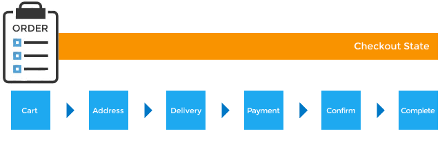

# Orders

## Components
### Order (Model)
See [here](../models/Order.md)

### Line Item (Model)
See [here](../models/LineItem.md)

### Adjustment (Model)
See [here](../models/Adjustment.md)

## Order States

1. `cart`: One or more products have been added to the shopping cart
2. `address`: Order is awaiting billing and shipping address data
3. `delivery`: Order is awaiting shipping method selection
4. `payment`: Order is awaiting payment data. Triggered if `payment_required?` returns `true`
5. `confirm`: Order is awaiting confirmation. Triggered if `confirmation_required?` returns `true`
6. `complete`:  No payment is required on the order or it is, at least the order total has been received as payment

> * An order cannot continue to the next state until the previous state has been satisfied
* you can transition an order by calling `next` on it. If `false` returns, then it doesn't meet
the next state's criteria. Check the `errors` message

## Order Statuses
Include order states in adddition to:
* `canceled`: Either customer or store admin has chosen to cancel the order
* `awaiting return`: Customer has elected to return products, but they have not yet been received.
* `return`: Return has been processed
* `resumed`: Formerly canceled order has been reactivated

## Order & Addresses
An order can link to two `Address` objects:
1. The shipping address indicates where the order's product(s) should be shipped to determines
shipping methods available
2. The billing address indicates where the user paying for the order is and can alter the tax
rate which can change the final order total

## Order Manual Entry
* Can be done through the Admin Interface (Orders -> New Order)
* Visually detailed in [Spree User Guide]
(https://guides.spreecommerce.com/user/entering_orders.html)

## Order Returns
See it under [Inventory Guide](../controllers/Inventory.md#Returns)

## *Customization Tips*
* Intermediary order states can be configured using the [Checkout Flow API](checkout.md)

### Updating an Order
If you change an `Order` object in code in anyway and you want to update totals and associated
adjustments and shipments, call `update!` method on the object (this will call `OrderUpdater`)

For example, if you create or modify an existing payment for the order which would change the order's
`payment_state` to a different value, calling `update!` will cause the `payment_state` to be
recalculated for that order.

Another example is if a `LineItem` within the order had its price changed. Calling `update!` will
cause the totals for the order to be updated, the adjustments for the order to be recalculated, and
then a final total to be established.