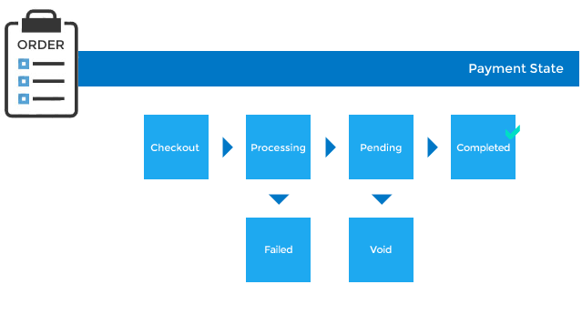

# Payments

## Components
### Payment (Model)
See [here](../models/Payment.md)

### Payment Method (Model)
See [here](../models/PaymentMethod.md)

### Gateway (Model)
See [here](../models/Gateway.md)

## Payment States


| State        | Description                                                | Callable with        |
|--------------|------------------------------------------------------------|----------------------|
| `checkout`   | still in checkout (before purchase or authorization)       |                      |
| `processing` | Temporary state to prevent double submission               | `started_processing` |
| `pending`    | Processed but incomplete (eg. authorized but not captured) | `pend`               |
| `failed`     | Payment rejected (e.g. card was declined)                  | `failure`            |
| `void`       | These payments do NOT count against order total            | `void`               |
| `completed`  | These payments count against order total                   | `complete`           |

| Event                | Description                                                                                                            |
|----------------------|------------------------------------------------------------------------------------------------------------------------|
| `started_processing` | Set after creating a profile and authorizing full amount to prevent reauthorizing once Order transitions to `complete` |
| `failure`            | When processing during checkout fails                                                                                  |
| `pend`               | Authorizing the payment                                                                                                |
| `complete`           | Completing a purchase or capture transaction                                                                           |
| `void`               |                                                                                                                        |
| `invalidate`         | Card brand isn't supported                                                                                             |

## Order & Payments
* Orders aren’t always completed in one transaction
* An order can have more than one payment associated with it if one payment is declined before another is authorized. 
* Each payment is processed separately, and has its own independent states for Spree to
track

## Merchant Account (FYI)
* A bank account that allows accepting credit card payments
* An Internet merchant account allows accepting payments online without having the customer's
credit card physically in front of you

## Credit Card Data
* In production mode, credit card data is transmitted only once and via SSL
* Data is immediately submitted to your payment gateway and then discarded before saving the model
* Only name, type, expiration and last four digits are saved and only for verification
* Other data is never stored in the database, not even temporarily. It exists in memory on the
server for a fraction of a second before it's discarded

## Authorize vs Capture
* *Authorize*: Confirming availability of funds for a transaction with purchaser's card company
* Spree By default handles authorizing the payment for a transaction
* *Capturing*: Telling the card company you want to get paid for a transaction amount
* Spree gives choice of auto-capturing payments or manually capturing them via the Admin Interface
* Typically, this two step process of authorizing and then capturing a payment is used by online
retailers to delay charging the customer until the purchase is fulfilled (shipped)
* Not all gateways allow the two step process. Confirm with your payment gateway and doctor too

## Processing
### Payment Profiles vs No Payment Profiles
#### Payment Profiles (Default)
* Service provided by some payment gateways
* Default checkout process in Spree assumes a gateway that allows for third party support for
payment profiles

###### Process
* Credit card gateway stores the credit card information
* Your application stores only a token that can be used to authorize future charges on that same
card without having to actually store it
* "token" is tied with your merchant account

###### Benefits
* Secure and PCI compliant means of storing the users credit card information
* Users can make subsequent purchases without having to reenter their card info
* Merchants can issue refunds to the credit card
* Merchants can make changes to an existing order without having to leave Spree and use the
gateway provider's website
* Ability to show a "confirmation" step after payment information is entered before an order is
processed since card number is now stored and can be used to perform standard authorization/capture
via the secure token provided by the gateway

#### No Payment Profiles
If you do not want to use Payment Profiles then you need to customize checkout since Spree
discards CC info after [Payment step](checkout.md#Payment) and so card info will be lost
before it's time to authorize it. In detail:
* Customize checkout so card info is entered and submitted on the final step
* Perform the authorization before the order is saved
* Remove any final "review and confirm" step

This is secure since CC information is transmitted to the gateway and then discarded

### Processing Walk-through (UI)
* Receiving an order, an admin needs to process its payment (this guide focuses on processing
credit card payments). An order is ready for processing if
  * Order State is "Complete", meaning all information customer needs to provide is present
  * Payment State is "Balance Due", meaning there is an unpaid balance on the order
  * Shipment State is "Pending", because you can't ship an order before you collect payment on it
* Click "Balance Due" to open the order's payment info page. Clicking "Capture" starts payment
processing
* If payment is processed successfully the page will show you that payment state has progressed
from "Pending" to "Completed"

### Processing Walk-through (Code)
* When an order is complete, each associated `Payment` object will have `process!` method called
on it to fulfill the order's balance (unless `payment_required?` returned `false`)
* If the payment method requires a source and the payment has one then processing starts.
Otherwise manual processing is needed
* If `PaymentMethod` is configured to *auto-capture*:
 * `Payment#purchase!` method is called which then calls `payment_method.purchase(<amount>, <source>, <gateway options>)`
 * If it's successful, payment is marked `completed`. If not, it's is marked `failed`
* If `PaymentMethod` is NOT configured to *auto-capture*:
  * `Payment#authorize!` method is called which then calls `payment_method.authorize(<amount>, <source>, <gateway options>)`
  * If it's successful, payment transitions to `pending` so it's manually captured later by calling
  `capture!` method. If not, payment is marked `failed`
* Returned objects from `purchase` or `authorize` are `ActiveMerchant::Billing::Response`
objects to be stored in `spree_log_entries` table as a YAML log entry for the payment
* Once a payment is saved, it updates the order which may change `payment_state`

> Increase in `payment_state` of `failed` could be a problem with the gateway. check `log_entries`

### Overall `payment_state` (for the whole order)
The states of all payments are combined to determine the overall payment state which
is what the storekeeper sees on the main order admin page

* `balance_due`: Payment is required for this order because there aren’t enough captured payments to meet the order total yet. This might mean there’s an authorized payment ready to manually capture, or it may be that no payment has been made yet
* `paid`: Captured payments cover the order total. Payment is done
* `credit_owed`: Captured payments add up to more than the order total so the customer is owed a refund. This might happen if items are removed from an order after it has been paid
* `failed`: Last payment for this order failed

### Payment Log Entries
Payment Log entries can be retrieved with a call to `log_entries` association on any `Payment` object.
To get `Active::Merchant::Billing::Response` out of `LogEntry` objects, call the `details` method.

## Voiding a Payment
Done from the Admin Interface

## *Customization Tips*
### Payment Profiles
* All `Gateway` classes have a `payment_profiles_supported?` method which indicates whether or
not payment profiles are supported
* If you are adding Spree support to a `Gateway` you should also implement the `create_profile`
method. The following is an example:
```
# Create a new CIM customer profile ready to accept a payment
def create_profile(payment)
  if payment.source.gateway_customer_profile_id.nil?
    profile_hash = create_customer_profile(payment)
    payment.source.update_attributes({
      :gateway_customer_profile_id => profile_hash[:customer_profile_id],
      :gateway_payment_profile_id => profile_hash[:customer_payment_profile_id])
    })
  end
end
```