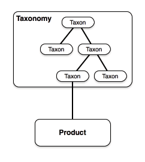
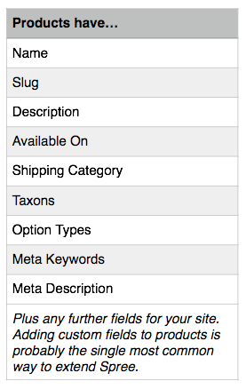
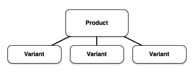
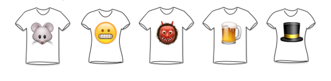
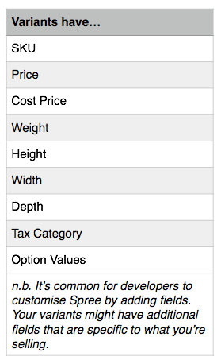
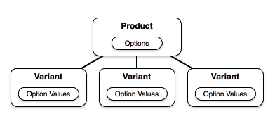
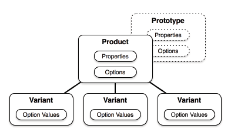
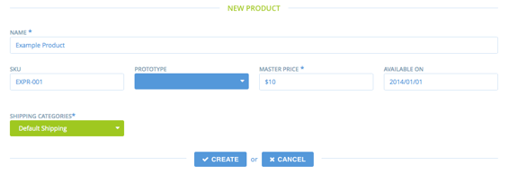

# Products Guide

## Components
### [Taxonomy](../models/Taxonomy.md) (Model)

* The category tree - a hierarchical list of individual Taxons
* Each `Taxonomy` relates to one `Taxon` that is its root node
* Admins can define many Taxonomies and link a product to multiple Taxons from each Taxonomy
* Taxonomies are ordered by their `position` attribute

### Taxon (Model)
See [here](../models/Taxon.md)

### Product (Model)
See [here](../models/Product.md)

## Variant (Model)
See [here](../models/Variant.md)

]

## Option Types and Option Values
See [here](../models/OptionType.md)

## Product Properties
See [here](../models/ProductProperty.md)

## Price
See [here](../models/Price.md)

## Prototypes
See [here](../models/Prototype.md)

