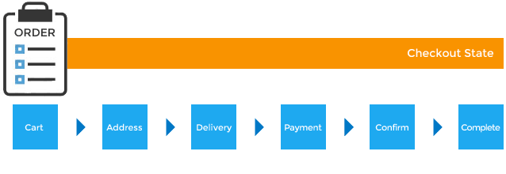

[Index](../_index.md) » Order

# (Class) [Spree::Order](http://m.gymplayer.com/order.rb)
A new order is initiated when a customer places a product in their shopping cart

### Attributes
* `number`: unique identifier for this order, begins with `R` and then a 9 numbers, can
 be used to find the order with `Order.find_by_number(number)`
* `item_total`: sum of all line items for this order
* `total`: sum of `item_total` and `adjustment_total`
* `state`: See Order State Machine below
* `adjustment_total`: sum of all adjustments on this order
* `user_id`: ID for user associated with the odrder if known
* `completed_at`: timestamp of when the order was completed
* `bill_address_id`: ID for related `Address` object with billing address information
* `ship_address_id`: ID for related `Address` object with shipping address information
* `payment_total`: total value of all finalized payments
* `shipping_method_id`: ID for related `ShippingMethod` object
* `shipment_state`: current shipment state. See [shipments model](Shipment.md)
* `payment_state`: current payment state. See [payments model](Payment.md)
* `email`: email address for the user who placed this order
* `special_instructions`: Will only appear if `Config[:shipping_instructions]` is set to `true`
* `currency`: Determined by `Config[:currency]` value that was set at order time
* `last_ip_address`: last IP address used to update this order in the frontend
* `created_by_id`: ID of whatever *object* created this order
* `shipment_total`: total value of all shipments' costs
* `additional_tax_total`: sum of all shipments' and line items' `additional_tax`
* `promo_total`: sum of all shipments', line items' and promotions' `promo_total`
* `channel`: channel specified if importing orders from other stores. e.g. amazon.
* `included_tax_total`: sum of all shipments' and line items' `included_tax`
* `item_count`: total value of line items' quantity
* `approver_id`: ID of user who approved this order
* `approved_at`
* `confirmation_delivered`: Boolean of confirmation email delivery
* `considered_risky`
* `guest_token`: token corresponding to the one stored in guest's cookies
* `canceled_at`
* `canceler_id`: ID of user that canceled this order
* `store_id`: ID of `Store` in which this order was created
* `state_lock_version`

### Methods
* `outstanding_balance`: calculated by taking `total` and subtracting `payment_total`
* `display_item_total`: A "pretty" version of `item_total`. If `item_total` was `10.0`,
 `display_item_total` would be `$10.00`
* `display_adjustment_total`: Same as above for `adjustment_total`
* `display_total`: Same as above for `total`
* `display_outstanding_balance`: Same as above for `outstanding_balance`

## Order States

1. `cart`: One or more products have been added to the shopping cart
2. `address`: Order is awaiting billing and shipping address data
3. `delivery`: Order is awaiting shipping method selection
4. `payment`: Order is awaiting payment data. Triggered if `payment_required?` returns `true`
5. `confirm`: Order is awaiting confirmation. Triggered if `confirmation_required?` returns `true`
6. `complete`:  reached in one of two ways:
    * No payment is required on the order
    * Payment is required on the order, and at least the order total has been received as payment

* An order cannot continue to the next state until the previous state has been satisfied
* you can transition an order by calling `next` on it. If `false` returns, then it doesn't meet
the criteria for the next state. Check the result of the `errors` method call
* Intermediary states can be configured using the Checkout Flow API (checkout)

## Order Statuses
Statuses include all order states and add to them:
* `canceled`: Either customer or store admin has chosen to cancel the order
* `awaiting return`: Customer has elected to return products, but they have not yet been received.
* `return`: Return has been processed
* `resumed`: Formerly canceled order has been reactivated


## Modules
* [Checkout](Order/Checkout.md)
* [CurrencyUpdater](Order/CurrencyUpdater.md)
* [Payments](Order/Payments.md)

## Constants
PAYMENT_STATES = balance_due checkout completed credit_owed failed paid pending processing void)
.freeze

SHIPMENT_STATES = backorder canceled partial pending ready shipped).freeze

## Methods included from
* [DisplayMoney](DisplayMoney.md)
* [CurrencyUpdater](Order/CurrencyUpdater.md)
* [Checkout](Order/Checkout.md)

## Instance Attributes
### (Object) **coupon_code**
Returns the value of attribute coupon_code

### (Object) **temporary_address**
Returns the value of attribute temporary_address

### (Object) **temporary_credit_card**
Returns the value of attribute temporary_credit_card

### (Object) **use_billing**
Returns the value of attribute use_billing

## Class Methods
### (Object) **complete**


### (Object) **incomplete**


### (Object) **register_line_item_comparison_hook**(hook)
Use this method in other gems that wish to register their own custom logic
that should be called when determining if two line items are equal.

### (Object) **register_update_hook**(hook)
Use this method in other gems that wish to register their own custom logic that should be called 
after Order#update

## Instance Methods
###  (Boolean) **all_inventory_units_returned?**


###  (Boolean) **allow_cancel?**    
    

### (Object) **amount**
For compatiblity with Calculator::PriceSack

### (Object) **apply_free_shipping_promotions**

    
### (Object) **approve!**


###  (Boolean) **approved?**


### (Object) **approved_by**(user)
    
    
### (Object) **associate_user!**(user, override_email = true)
Associates the specified user with the order.

### (Object) **available_payment_methods**


###  (Boolean) **backordered?**


### (Object) **billing_firstname**


### (Object) **billing_lastname**


###  (Boolean) **can_add_coupon?**


###  (Boolean) **can_approve?**


###  (Boolean) **can_ship?**


### (Object) **canceled_by**(user)
    
    
###  (Boolean) **checkout_allowed?**
Indicates whether or not the user is allowed to proceed to checkout. Currently this is implemented
as a check for whether or not there is at least one LineItem in the Order. Feel free to override
this logic in your own application if you require additional steps before allowing a checkout.

### (Object) **clone_billing_address**


###  (Boolean) **completed?**


###  (Boolean) **confirmation_required?**
If true, causes the confirmation step to happen during the checkout process

### (Object) **consider_risk**


### (Object) **considered_risky!**


### (Object) **contents**


### (Object) **create_proposed_shipments**


### (Object) **create_tax_charge!**
Creates new tax charges if there are any applicable rates. If prices already
include taxes then price adjustments are created instead.

### (Object) **credit_cards**


### (Object) **currency**


### (Object) **deliver_order_confirmation_email**
   

### (Object) **empty!**
    

### (Object) **ensure_line_item_variants_are_not_deleted**
Check to see if any line item variants are soft deleted. If so add error and restart checkout.
    
### (Object) **ensure_line_items_are_in_stock**
    

### (Object) **ensure_updated_shipments**
Clean shipments and make order back to address state. At some point the might need to force the 
order to transition from address to delivery again so that proper updated shipments are created. 
e.g. customer goes back from payment step and changes order items
    
### (Object) **finalize!**
Finalizes an in progress order after checkout is complete. Called after transition to complete 
state when payments will have been processed

### (Object) **find_line_item_by_variant**(variant, options = {})
    

### (Object) **fulfill!**


###  (Boolean) **fully_discounted?** Also known as: fully_discounted
determines whether the inventory is fully discounted. Returns:

* true if inventory amount is the exact negative of inventory related adjustments
* false otherwise

###  (Boolean) **has_non_reimbursement_related_refunds?**


###  (Boolean) **has_step?**(step)


### (Object) **insufficient_stock_lines**


###  (Boolean) **is_risky?**


### (Object) **line_item_options_match**(line_item, options)
This method enables extensions to participate in the “Are these line items equal” decision.
When adding to cart, an extension would send something like:
[params](:product_customizations)=…
and would provide:
```
def product_customizations_match
```

### (Object) **merge!**(order, user = nil)


### (Object) **name**
    
    
### (Object) **outstanding_balance**
If reimbursement has happened add it back to total to prevent balance_due payment state
See: https://github.com/spree/spree/issues/6229
  
###  (Boolean) **outstanding_balance?**


###  (Boolean) **paid?**
Helper methods for checkout steps

###  (Boolean) **payment_required?**
Is this a free order in which case the payment step should be skipped

### (Object) **pre_tax_item_amount**
Sum of all line item amounts pre-tax

### (Object) **quantity**


### (Object) **quantity_of**(variant, options = {})
    
    
### (Object) **refresh_shipment_rates**(shipping_method_filter = ShippingMethod::DISPLAY_ON_FRONT_END)


### (Object) **reload**(options = nil)
    
    
### (Object) **restart_checkout_flow**
    
    
### (Object) **set_shipments_cost**
    
    
###  (Boolean) **shipped?**


### (Object) **shipping_discount**


###  (Boolean) **shipping_eq_billing_address?**


### (Object) **state_changed**(name)
    
      
### (Object) **tax_address**
Returns the address for taxation based on configuration

### (Object) **tax_total**


### (Object) **tax_zone**
Returns the relevant zone (if any) to be used for taxation purposes. Uses
default tax zone unless there is a specific match

### (Object) **update!**


### (Object) **update_line_item_prices!**

        
### (Object) **updater**


### (Object) **valid_credit_cards**
    
    
    
