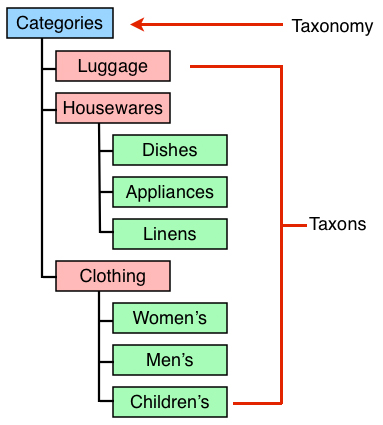

[Index](../_index.md) » Taxon

# (Class) [Spree::Taxon](http://m.gymplayer.com/taxon.rb)

* A single child node which exists at a given point within a [Taxonomy](ProductProperty.md)
* Each `Taxon` can contain many or no child taxons
* Admins can define many Taxonomies and link a product to multiple Taxons from each Taxonomy
* By default, both Taxons and Taxonomies are ordered by their `position` attribute
* Taxons use [Nested set model](http://en.wikipedia.org/wiki/Nested_set_model) for their hierarchy.
The `lft` and `rgt` columns in the `spree_taxons` table represent the locations within the hierarchy
of the item. This logic is handled by awesome_nested_set gem
* Taxons link to products through a `Classification` model that when a product is deleted, all links
from it to its taxons are deleted automatically. Similarly, when a taxon is deleted all links to
products are deleted automatically
* Linking to a taxon in a controller or a template should be done using `nested_taxons_path` helper
which will use the taxon's permalink to generate a URL such as `/t/categories/brand`

## Attributes
* `parent_id`
* `position`
* `name`: A required field for all taxons. The name determines what the user will see when they
look at this product in your store
* `permalink`: The end of the URL a user goes to, in order to see all products associated with this
taxon. This field is also required, and a value is automatically generated for you when you
create the taxon. Be careful with arbitrarily changing the permalink - if you have two taxons
with the same permalink you will run into issues
* `taxonomy_id`
* `lft`
* `rgt`
* `icon_file_name`: Icons are currently not functional
* `icon_content_type`
* `icon_file_size`
* `icon_updated_at`
* `description`: currently not functional
* `meta_title`: Overrides the store's setting for page title when a user visits the taxon's  page
 on the front end of the website
* `meta_description`: Overrides the store's setting for meta description when a user visits the
taxon's page on the front end of the website
* `meta_keywords`: Overrides the store's setting for meta keywords when a user visits the taxon's
 page on the front end of the website
* `depth`: depth of the taxon within the hierarchy, e.g. the most *parent* depth is 0

### Related Attributes `products_taxons`
* `product_id`
* `taxon_id`
* `position`

## Instance Methods
### (Object) **active_products**

### (Object) **applicable_filters**
indicate which filters should be used for a taxon this method should be customized to your own site

### (Object) **child_index=**(idx)
awesome_nested_set sorts by :lft and :rgt. This call re-inserts the child node so that its resulting
position matches the observable 0-indexed position. ** Note ** no :position column needed - a_n_s
doesn't handle the reordering if you bring your own :order_column. See #3390 for background.

### (Object) **pretty_name**

### (Object) **seo_title**
Return meta_title if set otherwise generates from root name and/or taxon name

### (Object) **set_permalink**
Creates permalink base for friendly_id
